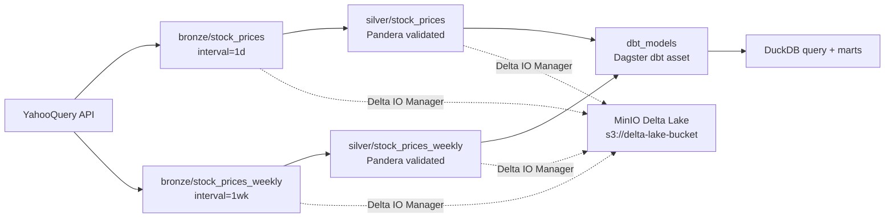
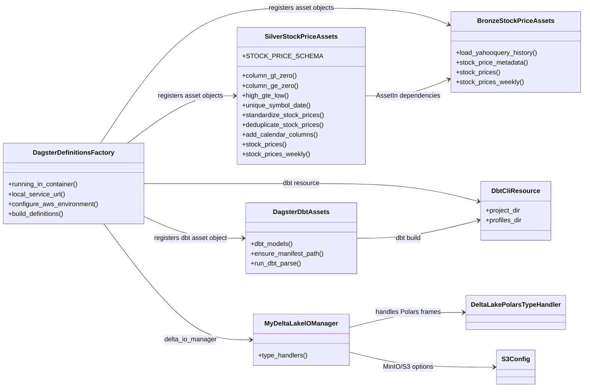
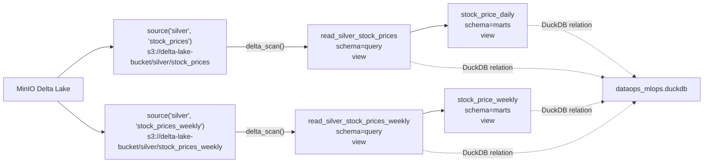
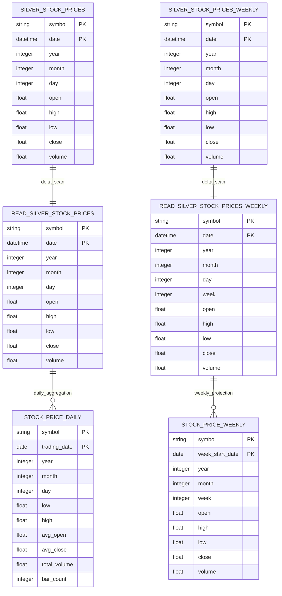
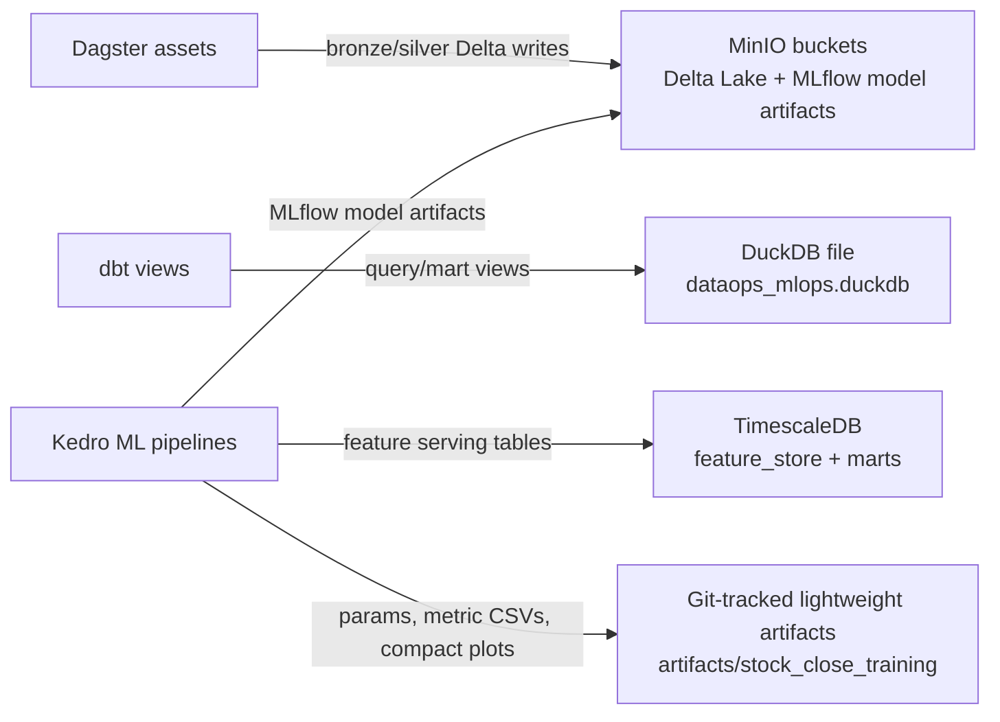

# Dagster And dbt Diagrams

## Dagster Asset Graph

## Dagster Runtime UML

Dagster still receives top-level asset objects named `stock_prices`,
`stock_prices_weekly`, and `dbt_models` from facade modules, but their compute
functions live as static methods in one-class implementation modules. This keeps
Dagster discovery stable while matching the project OOP convention.

## dbt Model Lineage

## dbt ER

## Runtime Storage Layout

## Operational Notes

- Dagster writes daily and weekly bronze/silver Delta tables to MinIO through
  `MyDeltaLakeIOManager`.
- dbt reads both daily and weekly silver Delta tables:
  `s3://delta-lake-bucket/silver/stock_prices` and
  `s3://delta-lake-bucket/silver/stock_prices_weekly`.
- Weekly silver is exposed through `read_silver_stock_prices_weekly` and
  `stock_price_weekly`, both materialized as DuckDB views.
- dbt writes query/mart views into DuckDB using `DBT_DUCKDB_PATH`.
- Lightweight Kedro artifacts under `artifacts/stock_close_training` are
  intentionally Git-trackable. Heavy runtime data remains in MinIO, TimescaleDB,
  or DuckDB instead of the project artifact folder.
