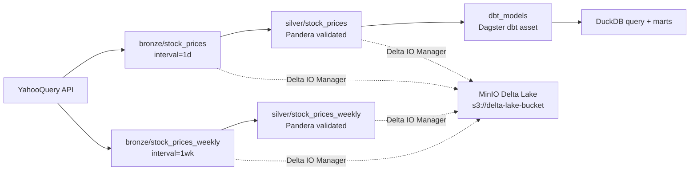
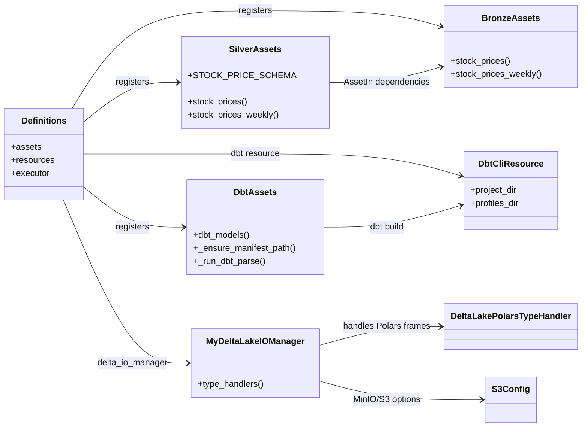
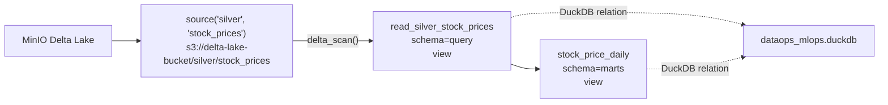
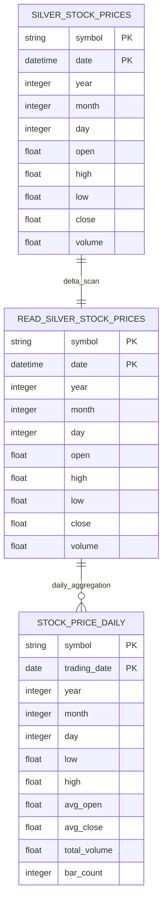

# Dagster And dbt Diagrams

## Dagster Asset Graph

## Dagster Runtime UML

## dbt Model Lineage

## dbt ER

## Operational Notes

- Dagster writes daily and weekly bronze/silver Delta tables to MinIO through
  `MyDeltaLakeIOManager`.
- dbt currently reads the daily silver table only:
  `s3://delta-lake-bucket/silver/stock_prices`.
- Weekly silver is consumed by Kedro tier5 feature engineering, not by the
  current dbt marts.
- dbt writes query/mart views into DuckDB using `DBT_DUCKDB_PATH`.
