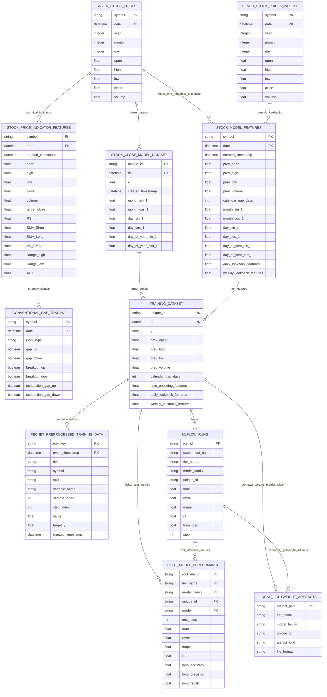

# Stock Close OOP And Data Diagrams

## Pipeline UML

```mermaid
classDiagram
    direction LR

    class StockClosePipelineFactory {
        +create_feature_engineering_pipeline()
        +create_conventional_gap_trading_pipeline()
        +create_machine_learning_pipeline()
        +create_pipeline()
    }

    class StockCloseModelMatrix {
        +model_tiers()
        +pecnet_only_tiers()
        +model_matrix_nodes()
        +tier_machine_learning_nodes()
        +pecnet_only_tier_machine_learning_nodes()
    }

    class StockCloseDataNodes {
        +configure_feature_engineering()
        +load_silver_stock_prices()
        +load_silver_stock_prices_weekly()
        +prepare_close_model_dataset()
        +publish_close_model_dataset()
        +prepare_indicator_features()
        +load_indicator_features()
        +publish_indicator_model_features()
        +prepare_conventional_gap_trading()
        +publish_conventional_gap_trading()
        +load_model_training_dataset()
        +train_test_split_for_tier()
    }

    class StockCloseFeatureEngineering {
        +read_silver_stock_prices()
        +read_silver_stock_prices_weekly()
        +write_delta_table()
        +build_stock_close_model_dataset()
        +build_stock_price_indicator_features()
        +build_stock_model_features()
        +build_stock_feature_sets()
        +build_conventional_gap_trading_features()
    }

    class FourierTimeEncoder {
        +add()
        +terms()
        +period()
        +harmonics()
    }

    class CloseModelDatasetBuilder {
        +build()
        +fill_business_day_gaps()
    }

    class StockPriceIndicatorFeatureBuilder {
        +build(silver_stock_prices, silver_stock_prices_weekly)
        +build_model_features(silver_stock_prices, silver_stock_prices_weekly)
        +build_feature_sets(silver_stock_prices, silver_stock_prices_weekly)
    }

    class LookbackFeatureBuilder {
        +add_daily_lookbacks()
        +attach_weekly_lookbacks()
    }

    class ConventionalGapTradingFeatureBuilder {
        +build()
    }

    class StockCloseModelNodes {
        +build_model_spec()
        +train_models()
        +build_statsforecast_model_spec_for_tier()
        +train_statsforecast_models()
        +build_pecnet_model_spec_for_tier()
        +train_pecnet_models()
        +evaluate_root_model_performance()
        +summarize_machine_learning()
        +summarize_training()
    }

    class FeatureStoreService {
        +publish_close_model_dataset()
        +publish_model_features()
        +publish_conventional_gap_trading()
        +load_stock_model_training_dataset_from_feast_online()
    }

    class FeatureStorePublisher {
        +publish_close_model_dataset()
        +publish_model_features()
        +publish_conventional_gap_trading()
        +publish_pecnet_preprocessed_training_data()
    }

    class FeatureStoreDefinitions {
        +apply_model_feature_definitions()
        +apply_close_model_dataset_definition_and_push()
        +apply_pecnet_preprocessed_definition_and_push()
    }

    class TimescaleFeatureWriter {
        +write_model_features_to_timescale()
        +write_close_model_dataset_to_timescale()
        +write_conventional_gap_trading_to_timescale()
        +write_pecnet_preprocessed_to_timescale()
    }

    class MLForecastService {
        +build_spec()
        +train_from_split()
        +train()
    }

    class MLForecastTrainer {
        +train_from_split()
    }

    class StatsForecastService {
        +build_spec()
        +train_from_split()
    }

    class StatsForecastTrainer {
        +train_from_split()
    }

    class PecnetService {
        +build_spec()
        +to_frame()
        +make_train_test_split()
        +train_from_split()
    }

    class PecnetDataPreprocessor {
        +prepare_ticker_inputs()
    }

    class PecnetDataModule {
        +_preprocess_ticker()
        +fit_target_profile()
        +fit_feature_profile_per_column()
    }

    class PecnetRuntimeModule {
        +_load_pecnet_runtime()
        +_configure_torch_threads()
        +_patch_basic_nn_device_selection()
        +_resolve_torch_device_name()
    }

    class PecnetTrainingWorkflow {
        +train_from_split()
    }

    class PecnetPerformanceMeasurement {
        +log_ticker_metadata()
        +prepare_ticker_inputs()
        +log_ticker_results()
    }

    class PecnetMlflowEpochTracker {
        +live_epoch_logging()
        +log_epoch_metrics()
    }

    class PecnetWorkflowModule {
        +_run_ticker_job_in_child_process()
        +_publish_deferred_preprocessed_inputs()
        +_pecnet_worker_count()
        +_pecnet_worker_torch_threads()
    }

    class PecnetTickerModule {
        +_train_one_ticker()
        +_drop_tomorrow_prediction()
        +_as_prediction_array()
    }

    class ForecastPerformanceMeasurement {
        +log_datasets()
        +measure()
        +log_result()
    }

    class RootModelPerformanceEvaluator {
        +evaluate()
    }

    class LightweightArtifactStore {
        +save_params()
        +save_metrics()
        +save_plot()
    }

    class MLflowTickerRun {
        +params
        +train_test_datasets
        +epoch_metrics
        +forecast_plots
        +model_artifact
    }

    class MlCommonModule {
        +_prediction_frame()
        +_regression_metrics_by_unique_id()
        +log_mlflow_datasets()
    }

    class MlMetricsModule {
        +long_only_directional_metrics_by_unique_id()
        +model_prediction_columns()
    }

    StockClosePipelineFactory --> StockCloseDataNodes : context/data node funcs
    StockClosePipelineFactory --> StockCloseModelNodes : model/performance/summary node funcs
    StockClosePipelineFactory --> StockCloseModelMatrix : expands ML nodes
    StockCloseModelMatrix --> StockCloseDataNodes : load/split node funcs
    StockCloseModelMatrix --> StockCloseModelNodes : spec/train node funcs
    StockCloseDataNodes --> StockCloseFeatureEngineering : builds once then passes
    StockCloseFeatureEngineering --> FourierTimeEncoder : composed
    StockCloseFeatureEngineering --> CloseModelDatasetBuilder : composed
    StockCloseFeatureEngineering --> StockPriceIndicatorFeatureBuilder : composed
    StockCloseFeatureEngineering --> LookbackFeatureBuilder : composed
    StockCloseFeatureEngineering --> ConventionalGapTradingFeatureBuilder : composed
    StockPriceIndicatorFeatureBuilder --> LookbackFeatureBuilder : model feature lookbacks only
    StockCloseDataNodes --> FeatureStoreService : publish/load
    FeatureStoreService --> FeatureStorePublisher : publish methods
    FeatureStorePublisher --> TimescaleFeatureWriter : offline writes
    FeatureStorePublisher --> FeatureStoreDefinitions : Feast apply + online push
    StockCloseModelNodes --> MLForecastService : delegates
    StockCloseModelNodes --> StatsForecastService : delegates
    StockCloseModelNodes --> PecnetService : delegates
    StockCloseModelNodes --> RootModelPerformanceEvaluator : root MLflow evaluation
    MLForecastService --> MLForecastTrainer : training
    MLForecastTrainer --> ForecastPerformanceMeasurement : performance measurement
    MLForecastTrainer --> LightweightArtifactStore : local params
    ForecastPerformanceMeasurement --> MlCommonModule : ticker regression metrics
    ForecastPerformanceMeasurement --> MlMetricsModule : ticker direction metrics
    ForecastPerformanceMeasurement --> LightweightArtifactStore : local metrics/plots
    StatsForecastService --> StatsForecastTrainer : training
    StatsForecastTrainer --> ForecastPerformanceMeasurement : performance measurement
    StatsForecastTrainer --> LightweightArtifactStore : local params
    PecnetService --> PecnetTrainingWorkflow : training workflow
    PecnetTrainingWorkflow --> PecnetRuntimeModule : torch/PECNet runtime
    PecnetTrainingWorkflow --> PecnetDataPreprocessor : data preprocess
    PecnetDataPreprocessor --> PecnetDataModule : preprocessing helpers
    PecnetTrainingWorkflow --> PecnetPerformanceMeasurement : ticker metadata + performance
    PecnetTrainingWorkflow --> PecnetMlflowEpochTracker : step-indexed train_loss metrics
    PecnetTrainingWorkflow --> PecnetWorkflowModule : process-per-ticker helpers
    PecnetPerformanceMeasurement --> LightweightArtifactStore : local params/metrics/plots
    PecnetPerformanceMeasurement --> MLflowTickerRun : ticker-scoped run outputs
    PecnetWorkflowModule --> PecnetTickerModule : ticker train jobs
    PecnetWorkflowModule --> FeatureStoreService : parent-process preprocessed publish
    PecnetTickerModule --> PecnetDataPreprocessor : preprocessed target/features
    RootModelPerformanceEvaluator --> MlCommonModule : root ticker regression metrics
    RootModelPerformanceEvaluator --> MlMetricsModule : root ticker direction metrics
    RootModelPerformanceEvaluator --> LightweightArtifactStore : local metrics/params
```

## Data ER

## Data Notes

- `stock_price_indicator_features` is a Delta feature-engineering dataset for
  indicator and conventional gap research. It keeps `date`, OHLCV,
  `target_close`, and technical indicators only; it does not carry calendar,
  `prev_*`, Fourier time encodings, or daily/weekly lag columns.
- `stock_model_features` is the Feast/Timescale model feature table. It carries
  model-tier features such as `prev_*`, `calendar_gap_days`, Fourier encodings,
  and daily/weekly lookback columns for MLForecast and StatsForecast tiers.
- PECNet tier5 uses the configured tier5 feature columns from
  `parameters_machine_learning.yml`, including daily and weekly lookback
  columns, then applies the PECNet framework's `DataPreprocessor` sampling,
  statistics, and wavelet steps to each selected input series.
- PECNet tier6 is PECNet-only. It uses `y` as the target close series plus
  `weekly_close_lag_1`, `calendar_gap_days`, and Fourier time encodings from
  `stock_model_features`. The weekly close value is attached through the weekly
  as-of lookback path, so daily rows in the next week see the completed previous
  weekly bar, not the unfinished current week. Tier6 overrides PECNet sampling
  to `[1, 4, 8]`.
- PECNet prediction evaluation drops the framework's final tomorrow placeholder
  before joining predictions back to the test dates. There is no post-hoc
  train calibration layer: the wrapper follows the PECNet framework examples by
  fitting the target series with its own preprocessing profile and fitting each
  feature column with its own profile. This keeps large features such as volume
  from contaminating the target close scaler.
- PECNet ticker training can run in parallel through process workers configured
  by `stock_close_machine_learning.runtime.pecnet_n_jobs`. Workers use
  `pecnet_torch_threads_per_worker` to avoid multiplying PyTorch threads across
  processes.
- In parallel PECNet runs, each worker logs its ticker datasets and MLflow
  outputs, but Feast/Timescale preprocessed-store writes are deferred and
  published once in the parent process. This avoids concurrent writes to
  `feature_repo/data/registry.db` while keeping ticker training parallel.
- PECNet runtime patches the external `BasicNN` device selection without editing
  the `pecnetframework` source. `pecnet_torch_device: auto` chooses `mps` on
  supported native macOS PyTorch, then `cuda`, then `cpu`; MLflow logs the
  requested and selected torch device on each ticker-level PECNet run.
- PECNet epoch losses are logged directly to MLflow as step-indexed metrics and
  per-ticker epoch metric artifacts. No extra experiment-tracking service,
  credential, or client runtime is required.
- MLForecast, StatsForecast, PECNet, and the root performance run all calculate
  evaluation rows per `unique_id`; MLflow metric keys include ticker scope, for example
  `root.tier1.mlforecast.AAPL.RandomForest.test.rmse`.
- Lightweight local artifacts are also written under
  `artifacts/stock_close_training` for params, metric CSVs, and compact plot PNGs
  only. This folder is intentionally allowed through `.gitignore` so lightweight
  artifacts can be pushed to GitHub. Models, train/test frames, predictions,
  Delta tables, and MinIO data stay out of this folder to keep project disk
  usage low.
- Python source in `kedro_project/src/mlops_kedro`, Dagster source, and runtime
  bootstrap code uses class-only implementation modules plus small facade modules.
  The class files carry one class each; framework compatibility names such as
  `create_pipeline`, `register_pipelines`, and `publish_model_features` live in
  facade modules so existing Kedro/Dagster imports keep working.
