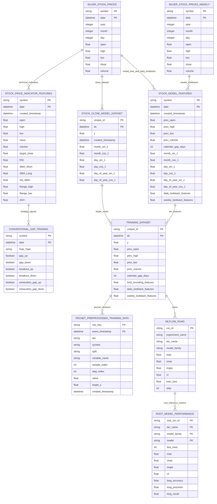

# Stock Close OOP And Data Diagrams

## Pipeline UML

```mermaid
classDiagram
    direction LR

    class KedroPipeline {
        +create_feature_engineering_pipeline()
        +create_conventional_gap_trading_pipeline()
        +create_machine_learning_pipeline()
        +create_pipeline()
    }

    class ModelMatrix {
        +model_matrix_nodes()
        +tier_machine_learning_nodes()
        +pecnet_only_tier_machine_learning_nodes()
    }

    class StockCloseDataNodes {
        +configure_feature_engineering()
        +load_silver_stock_prices()
        +load_silver_stock_prices_weekly()
        +prepare_close_model_dataset()
        +publish_close_model_dataset()
        +prepare_indicator_features()
        +load_indicator_features()
        +publish_indicator_model_features()
        +prepare_conventional_gap_trading()
        +publish_conventional_gap_trading()
        +load_model_training_dataset()
        +train_test_split_for_tier()
    }

    class StockCloseFeatureEngineering {
        +read_silver_stock_prices()
        +read_silver_stock_prices_weekly()
        +write_delta_table()
        +build_stock_close_model_dataset()
        +build_stock_price_indicator_features()
        +build_stock_model_features()
        +build_stock_feature_sets()
        +build_conventional_gap_trading_features()
    }

    class FourierTimeEncoder {
        +add()
        +terms()
        +period()
        +harmonics()
    }

    class CloseModelDatasetBuilder {
        +build()
        +fill_business_day_gaps()
    }

    class StockPriceIndicatorFeatureBuilder {
        +build(silver_stock_prices, silver_stock_prices_weekly)
        +build_model_features(silver_stock_prices, silver_stock_prices_weekly)
        +build_feature_sets(silver_stock_prices, silver_stock_prices_weekly)
    }

    class LookbackFeatureBuilder {
        +add_daily_lookbacks()
        +attach_weekly_lookbacks()
    }

    class ConventionalGapTradingFeatureBuilder {
        +build()
    }

    class StockCloseModelNodes {
        +build_model_spec()
        +train_models()
        +build_statsforecast_model_spec_for_tier()
        +train_statsforecast_models()
        +build_pecnet_model_spec_for_tier()
        +train_pecnet_models()
        +evaluate_root_model_performance()
        +summarize_machine_learning()
        +summarize_training()
    }

    class FeatureStoreService {
        +publish_close_model_dataset()
        +publish_model_features()
        +publish_conventional_gap_trading()
        +load_stock_model_training_dataset_from_feast_online()
    }

    class MLForecastService {
        +build_spec()
        +train_from_split()
        +train()
    }

    class MLForecastTrainer {
        +train_from_split()
    }

    class StatsForecastService {
        +build_spec()
        +train_from_split()
    }

    class StatsForecastTrainer {
        +train_from_split()
    }

    class PecnetService {
        +build_spec()
        +to_frame()
        +make_train_test_split()
        +train_from_split()
    }

    class PecnetDataPreprocessor {
        +prepare_ticker_inputs()
    }

    class PecnetTrainingWorkflow {
        +train_from_split()
    }

    class PecnetPerformanceMeasurement {
        +log_parent_metadata()
        +prepare_ticker_inputs()
        +log_ticker_results()
        +log_parent_outputs()
    }

    class PecnetMlflowEpochTracker {
        +live_epoch_logging()
        +log_epoch_metrics()
    }

    class ForecastPerformanceMeasurement {
        +log_datasets()
        +measure()
        +log_result()
    }

    class RootModelPerformanceEvaluator {
        +evaluate()
    }

    KedroPipeline --> StockCloseDataNodes : context/data node funcs
    KedroPipeline --> StockCloseModelNodes : model/performance/summary node funcs
    KedroPipeline --> ModelMatrix : expands ML nodes
    ModelMatrix --> StockCloseDataNodes : load/split node funcs
    ModelMatrix --> StockCloseModelNodes : spec/train node funcs
    StockCloseDataNodes --> StockCloseFeatureEngineering : builds once then passes
    StockCloseFeatureEngineering --> FourierTimeEncoder : composed
    StockCloseFeatureEngineering --> CloseModelDatasetBuilder : composed
    StockCloseFeatureEngineering --> StockPriceIndicatorFeatureBuilder : composed
    StockCloseFeatureEngineering --> LookbackFeatureBuilder : composed
    StockCloseFeatureEngineering --> ConventionalGapTradingFeatureBuilder : composed
    StockPriceIndicatorFeatureBuilder --> LookbackFeatureBuilder : model feature lookbacks only
    StockCloseDataNodes --> FeatureStoreService : publish/load
    StockCloseModelNodes --> MLForecastService : delegates
    StockCloseModelNodes --> StatsForecastService : delegates
    StockCloseModelNodes --> PecnetService : delegates
    StockCloseModelNodes --> RootModelPerformanceEvaluator : root MLflow evaluation
    MLForecastService --> MLForecastTrainer : training
    MLForecastTrainer --> ForecastPerformanceMeasurement : performance measurement
    StatsForecastService --> StatsForecastTrainer : training
    StatsForecastTrainer --> ForecastPerformanceMeasurement : performance measurement
    PecnetService --> PecnetTrainingWorkflow : training workflow
    PecnetTrainingWorkflow --> PecnetDataPreprocessor : data preprocess
    PecnetTrainingWorkflow --> PecnetPerformanceMeasurement : performance measurement
    PecnetTrainingWorkflow --> PecnetMlflowEpochTracker : step-indexed train_loss metrics
```

## Data ER

## Data Notes

- `stock_price_indicator_features` is a Delta feature-engineering dataset for
  indicator and conventional gap research. It keeps `date`, OHLCV,
  `target_close`, and technical indicators only; it does not carry calendar,
  `prev_*`, Fourier time encodings, or daily/weekly lag columns.
- `stock_model_features` is the Feast/Timescale model feature table. It carries
  model-tier features such as `prev_*`, `calendar_gap_days`, Fourier encodings,
  and daily/weekly lookback columns for MLForecast and StatsForecast tiers.
- PECNet tier5 uses the configured tier5 feature columns from
  `parameters_machine_learning.yml`, including daily and weekly lookback
  columns, then applies the PECNet framework's `DataPreprocessor` sampling,
  statistics, and wavelet steps to each selected input series.
- PECNet tier6 is PECNet-only. It uses `y` as the target close series plus
  `weekly_close_lag_1`, `calendar_gap_days`, and Fourier time encodings from
  `stock_model_features`. The weekly close value is attached through the weekly
  as-of lookback path, so daily rows in the next week see the completed previous
  weekly bar, not the unfinished current week. Tier6 overrides PECNet sampling
  to `[1, 4, 8]`.
- PECNet epoch losses are logged directly to MLflow as step-indexed metrics and
  per-ticker epoch metric artifacts. No extra experiment-tracking service,
  credential, or client runtime is required.
