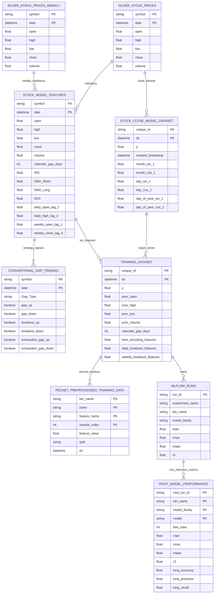

# Stock Close OOP And Data Diagrams

## Pipeline UML

```mermaid
classDiagram
    direction LR

    class KedroPipeline {
        +create_feature_engineering_pipeline()
        +create_conventional_gap_trading_pipeline()
        +create_machine_learning_pipeline()
        +create_pipeline()
    }

    class ModelMatrix {
        +model_matrix_nodes()
        +tier_machine_learning_nodes()
        +pecnet_only_tier_machine_learning_nodes()
    }

    class StockCloseDataNodes {
        +configure_feature_engineering()
        +load_silver_stock_prices()
        +load_silver_stock_prices_weekly()
        +prepare_close_model_dataset()
        +publish_close_model_dataset()
        +prepare_indicator_features()
        +load_indicator_features()
        +publish_indicator_model_features()
        +prepare_conventional_gap_trading()
        +publish_conventional_gap_trading()
        +load_model_training_dataset()
        +train_test_split_for_tier()
    }

    class StockCloseFeatureEngineering {
        +read_silver_stock_prices()
        +read_silver_stock_prices_weekly()
        +write_delta_table()
        +build_stock_close_model_dataset()
        +build_stock_price_indicator_features()
        +build_conventional_gap_trading_features()
    }

    class FourierTimeEncoder {
        +add()
        +terms()
        +period()
        +harmonics()
    }

    class CloseModelDatasetBuilder {
        +build()
        +fill_business_day_gaps()
    }

    class StockPriceIndicatorFeatureBuilder {
        +build(silver_stock_prices, silver_stock_prices_weekly)
    }

    class LookbackFeatureBuilder {
        +add_daily_lookbacks()
        +attach_weekly_lookbacks()
    }

    class ConventionalGapTradingFeatureBuilder {
        +build()
    }

    class StockCloseModelNodes {
        +build_model_spec()
        +train_models()
        +build_statsforecast_model_spec_for_tier()
        +train_statsforecast_models()
        +build_pecnet_model_spec_for_tier()
        +train_pecnet_models()
        +evaluate_root_model_performance()
        +summarize_machine_learning()
        +summarize_training()
    }

    class FeatureStoreService {
        +publish_close_model_dataset()
        +publish_model_features()
        +publish_conventional_gap_trading()
        +load_stock_model_training_dataset_from_feast_online()
    }

    class MLForecastService {
        +build_spec()
        +train_from_split()
        +train()
    }

    class MLForecastTrainer {
        +train_from_split()
    }

    class StatsForecastService {
        +build_spec()
        +train_from_split()
    }

    class StatsForecastTrainer {
        +train_from_split()
    }

    class PecnetService {
        +build_spec()
        +to_frame()
        +make_train_test_split()
        +train_from_split()
    }

    class PecnetDataPreprocessor {
        +prepare_ticker_inputs()
    }

    class PecnetTrainingWorkflow {
        +train_from_split()
    }

    class PecnetPerformanceMeasurement {
        +log_parent_metadata()
        +prepare_ticker_inputs()
        +log_ticker_results()
        +log_parent_outputs()
    }

    class ForecastPerformanceMeasurement {
        +log_datasets()
        +measure()
        +log_result()
    }

    class RootModelPerformanceEvaluator {
        +evaluate()
    }

    KedroPipeline --> StockCloseDataNodes : context/data node funcs
    KedroPipeline --> StockCloseModelNodes : model/performance/summary node funcs
    KedroPipeline --> ModelMatrix : expands ML nodes
    ModelMatrix --> StockCloseDataNodes : load/split node funcs
    ModelMatrix --> StockCloseModelNodes : spec/train node funcs
    StockCloseDataNodes --> StockCloseFeatureEngineering : builds once then passes
    StockCloseFeatureEngineering --> FourierTimeEncoder : composed
    StockCloseFeatureEngineering --> CloseModelDatasetBuilder : composed
    StockCloseFeatureEngineering --> StockPriceIndicatorFeatureBuilder : composed
    StockCloseFeatureEngineering --> LookbackFeatureBuilder : composed
    StockCloseFeatureEngineering --> ConventionalGapTradingFeatureBuilder : composed
    StockPriceIndicatorFeatureBuilder --> LookbackFeatureBuilder : daily4/weekly4 features
    StockCloseDataNodes --> FeatureStoreService : publish/load
    StockCloseModelNodes --> MLForecastService : delegates
    StockCloseModelNodes --> StatsForecastService : delegates
    StockCloseModelNodes --> PecnetService : delegates
    StockCloseModelNodes --> RootModelPerformanceEvaluator : root MLflow evaluation
    MLForecastService --> MLForecastTrainer : training
    MLForecastTrainer --> ForecastPerformanceMeasurement : performance measurement
    StatsForecastService --> StatsForecastTrainer : training
    StatsForecastTrainer --> ForecastPerformanceMeasurement : performance measurement
    PecnetService --> PecnetTrainingWorkflow : training workflow
    PecnetTrainingWorkflow --> PecnetDataPreprocessor : data preprocess
    PecnetTrainingWorkflow --> PecnetPerformanceMeasurement : performance measurement
```

## Data ER

```mermaid
erDiagram
    SILVER_STOCK_PRICES {
        string symbol PK
        datetime date PK
        float open
        float high
        float low
        float close
        float volume
    }

    SILVER_STOCK_PRICES_WEEKLY {
        string symbol PK
        datetime date PK
        float open
        float high
        float low
        float close
        float volume
    }

    STOCK_CLOSE_MODEL_DATASET {
        string unique_id PK
        datetime ds PK
        float y
        datetime created_timestamp
        float month_sin_1
        float month_cos_1
        float day_sin_1
        float day_cos_1
        float day_of_year_sin_1
        float day_of_year_cos_1
    }

    STOCK_MODEL_FEATURES {
        string symbol PK
        datetime date PK
        float open
        float high
        float low
        float close
        float volume
        int calendar_gap_days
        float RSI
        float SMA_Short
        float SMA_Long
        float ADX
        float daily_open_lag_1
        float daily_high_lag_4
        float weekly_open_lag_1
        float weekly_close_lag_4
    }

    CONVENTIONAL_GAP_TRADING {
        string symbol PK
        datetime date PK
        string Gap_Type
        boolean gap_up
        boolean gap_down
        boolean breakout_up
        boolean breakout_down
        boolean exhaustion_gap_up
        boolean exhaustion_gap_down
    }

    TRAINING_DATASET {
        string unique_id PK
        datetime ds PK
        float y
        float prev_open
        float prev_high
        float prev_low
        float prev_volume
        int calendar_gap_days
        float time_encoding_features
        float daily_lookback_features
        float weekly_lookback_features
    }

    PECNET_PREPROCESSED_TRAINING_DATA {
        string tier_name PK
        string ticker PK
        string feature_name PK
        int sample_index PK
        float feature_value
        string split
        datetime ds
    }

    MLFLOW_RUNS {
        string run_id PK
        string experiment_name
        string tier_name
        string model_family
        float mae
        float rmse
        float mape
        float r2
    }

    ROOT_MODEL_PERFORMANCE {
        string root_run_id PK
        string tier_name PK
        string model_family PK
        string model PK
        int test_rows
        float mae
        float rmse
        float mape
        float r2
        float long_accuracy
        float long_precision
        float long_recall
    }

    SILVER_STOCK_PRICES ||--o{ STOCK_CLOSE_MODEL_DATASET : close_dataset
    SILVER_STOCK_PRICES ||--o{ STOCK_MODEL_FEATURES : indicators
    SILVER_STOCK_PRICES_WEEKLY ||--o{ STOCK_MODEL_FEATURES : weekly_lookbacks
    STOCK_MODEL_FEATURES ||--o{ CONVENTIONAL_GAP_TRADING : strategy_signals
    STOCK_CLOSE_MODEL_DATASET ||--o{ TRAINING_DATASET : target_series
    STOCK_MODEL_FEATURES ||--o{ TRAINING_DATASET : tier_features
    TRAINING_DATASET ||--o{ PECNET_PREPROCESSED_TRAINING_DATA : pecnet_windows
    TRAINING_DATASET ||--o{ MLFLOW_RUNS : trains
    MLFLOW_RUNS ||--o{ ROOT_MODEL_PERFORMANCE : root_inference_metrics
```
